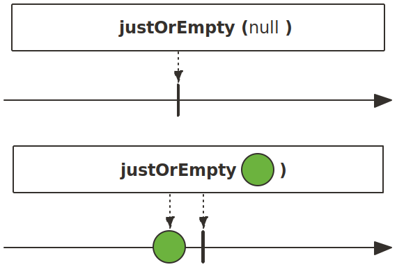
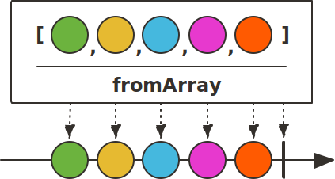
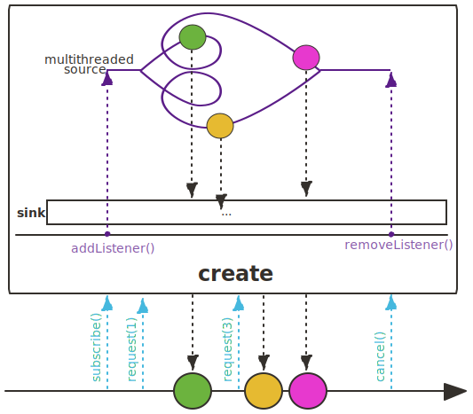
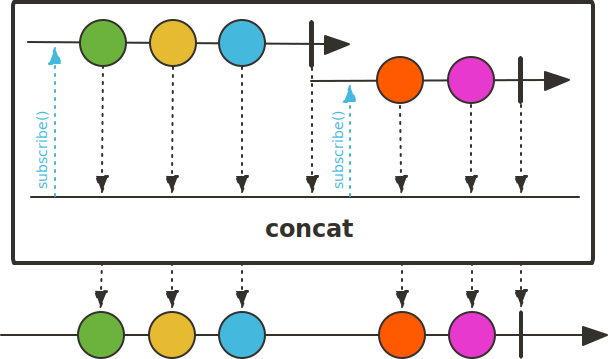

# ReactorExample
## Reactor 反应式编程基础
本部分介绍Reactor基础，为后续业务实现打基础。涉及的内容有 
- [反应式编程介绍](#反应式编程介绍)
- [Reactor介绍](#Reactor介绍)
- [创建Flux](#创建Flux)
- [创建Mono](#创建Mono)
- [使用StepVerifier测试](#使用StepVerifier测试)
- [调试](#调试)
    - [启用调试模式](#启用调试模式)
    - [使用检查点](#使用检查点)
    - [日志记录](#日志记录)
- [操作符](#操作符)
    - [创建序列](#创建序列)
		- [just](#just)
		- [justOrEmpty](#justOrEmpty)
		- [fromArray](#fromArray)
		- [fromSupplier](#fromSupplier)
		- [range](#range)
		- [fromStream](#fromStream)
		- [fromCallable](#fromCallable)
		- [fromRunnable](#fromRunnable)
		- [fromFuture](#fromFuture)
		- [empty](#empty)
		- [error](#error)
		- [defer](#defer)
		- [using](#using)
		- [generate](#generate)
		- [create](#create)
    - [转换序列](#转换序列)
		- [map](#map)
		- [cast](#cast)
		- [index](#index)
		- [flatMap](#flatMap)
		- [flatMapSequential](#flatMapSequential)
		- [flatMapMany](#flatMapMany)
		- [startWith](#startWith)
		- [concatWith](#concatWith)
		- [collectList](#collectList)
		- [collectSortedList](#collectSortedList)
		- [collectMap](#collectMap)
		- [collectMultiMap](#collectMultiMap)
		- [count](#count)
		- [all](#all)
		- [any](#any)
		- [hasElement](#hasElement)
		- [hasElement](#hasElement)
		- [concat](#concat)
		- [concatWith](#concatWith)
		- [concatDelayError](#concatDelayError)
		- [mergeSequential](#mergeSequential)
		- [merge](#merge)
		- [mergeWith](#mergeWith)
		- [zip](#zip)
		- [zipWith](#zipWith)
		- [and](#and)
		- [when](#when)
		- [combineLatest](#combineLatest)
		- [first](#first)
		- [or](#or)
		- [switchMap](#switchMap)
		- [switchOnNext](#switchOnNext)
		- [repeat](#repeat)
		- [interval](#interval)
		- [defaultIfEmpty](#defaultIfEmpty)
		- [switchIfEmpty](#switchIfEmpty)
		- [ignoreElements](#ignoreElements)
		- [then](#then)
		- [thenEmpty](#thenEmpty) 
		- [thenReturn](#thenReturn)
		- [thenMany](#thenMany)
		- [delayUntil](#delayUntil)
		- [expand](#expand) 
		- [expandDeep](#expandDeep)
		- [reduce](#reduce)
		- [scan](#scan)
    - [只读序列](#只读序列)
		- [doOnNext](#doOnNext)
    - [过虑序列](#过虑序列)
    - [错误处理](#错误处理)
    - [基于时间的操作](#基于时间的操作)
    - [拆分Flux](#拆分Flux)
    - [回到同步的世界](#回到同步的世界)
- [调度器](#调度器)
- [消息处理](#消息处理)
- [“懒”和“急”](#“懒”和“急”)
- [参考内容](#参考内容)
### 反应式编程介绍
```Webflux``` 使用 [Reactor](https://projectreactor.io/docs) 进行反应式编程，java的反应式编程库还有 [Rxjava](https://github.com/ReactiveX/RxJava) 和 [Rxjava2](https://github.com/ReactiveX/RxJava/wiki/What's-different-in-2.0) 。

反应式编程采用声明性代码来构建异步处理链，使用订阅者-发布者模式，发布者产生新数据时，会推送给订阅者，只有订阅者进行订阅操作后，整个处理链才会执行。即在订阅之前，什么都不会操作。和 ```Stream``` 流类似，执行终止操作前，数据流不会执行任何操作。
### Reactor介绍
```Reactor```则是基于反应式流规范设计和实现的库，使用起来比较简单直观。Spring 5 中反应式编程库用的也是 ```Reactor```。

```Flux```和 ```Mono``` 是 ```Reactor``` 中的两个基本概念。```Flux ```表示的是包含 0 到 N 个元素的异步序列。在该序列中可以包含三种不同类型的消息通知：正常的包含元素的消息、序列结束的消息和序列出错的消息。当消息通知产生时，订阅者中对应的方法 ```onNext()```,```onComplete()```和 ```onError()```会被调用。

```Mono``` 表示的是包含 0 或者 1 个元素的异步序列。该序列中同样可以包含与 ```Flux``` 相同的三种类型的消息通知。

```Flux``` 和 ```Mono``` 之间可以进行转换。

对一个 ```Flux``` 序列进行计数操作，得到的结果是一个 ```Mono<Long>```对象。把两个 ```Mono``` 序列合并在一起，得到的是一个 ```Flux``` 对象。

### 创建Flux 


```Flux```  是反应式流发布者(Publisher),可以执行各种流式操作，比如生成、转换、过滤等。大部分 ```Stream流``` 中的操作，都可以在Flux中找到对应的操作。
使用静态方法生成Flux
- just()
    可以指定序列中包含的全部元素。创建出来的 Flux 序列在发布这些元素之后会自动结束。
- fromArray()，fromIterable()和 fromStream()
    可以从一个数组、Iterable 对象或 Stream 对象中创建 Flux 对象。
- empty()：
    创建一个不包含任何元素，只发布结束消息的序列。
- error(Throwable error)
    创建一个只包含错误消息的序列。
- never() 
    创建一个不包含任何消息通知的序列。
- range(int start, int count)
    创建包含从 start 起始的 count 个数量的 Integer 对象的序列。
- interval(Duration period)和interval(Duration delay, Duration period)
    创建一个包含了从 0 开始递增的 Long 对象的序列。其中包含的元素按照指定的间隔来发布。除了间隔时间之外，还可以指定起始元素发布之前的延迟时间。
- intervalMillis(long period)和 intervalMillis(long delay, long period)
    与 interval()方法的作用相同，只不过该方法通过毫秒数来指定时间间隔和延迟时间。

```Part01Flux.java```
```java
public class Part01Flux {

    //  Return an empty Flux
    Flux<String> emptyFlux() {
        return Flux.empty();
    }


    //  Return a Flux that contains 2 values "foo" and "bar" without using an array or a collection
    Flux<String> fooBarFluxFromValues() {
        return Flux.just("foo", "bar");
    }


    // Create a Flux from a List that contains 2 values "foo" and "bar"
    Flux<String> fooBarFluxFromList() {
        return Flux.fromIterable(Arrays.asList(new String[]{"foo", "bar"}));
    }

    //  Create a Flux that emits an IllegalStateException
    Flux<String> errorFlux() {
        return Flux.error(new IllegalStateException());
    }

    //  Create a Flux that emits increasing values from 0 to 9 each 100ms
    Flux<Long> counter() {
        return Flux.interval(Duration.ofMillis(100)).take(10);
    }
    Flux<Integer> range(){
        return Flux.range(1,5);
    }
}
```
测试代码```Part01FluxTest.java```
```java
public class Part01FluxTest {
    Part01Flux part01Flux;

    @Before
    public void init() {
        part01Flux = new Part01Flux();
    }

    @Test
    public void emptyFlux() {
        StepVerifier.create(part01Flux.emptyFlux())
                .expectComplete()
                .verify();
    }

    @Test
    public void fooBarFluxFromValues() {
        StepVerifier.create(part01Flux.fooBarFluxFromValues())
                .expectNext("foo", "bar")
                .expectComplete()
                .verify();
    }

    @Test
    public void fooBarFluxFromList() {
        StepVerifier.create(part01Flux.fooBarFluxFromList())
                .expectNext("foo", "bar")
                .expectComplete()
                .verify();
    }

    @Test
    public void errorFlux() {
        StepVerifier.create(part01Flux.errorFlux())
                .expectError(IllegalStateException.class)
                .verify();
    }

    @Test
    public void counter() {
        StepVerifier.create(part01Flux.counter())
                .expectNext(0l, 1l, 2l, 3l, 4l, 5l, 6l, 7l, 8l, 9l)
                .expectComplete()
                .verify();
    }

    @Test
    public void range() {
        StepVerifier.create(part01Flux.range())
                .expectNext( 1, 2, 3, 4, 5)
                .expectComplete()
                .verify();

    }
}
```

### 创建Mono


[Mono](https://projectreactor.io/docs/core/release/api/reactor/core/publisher/Mono.html)
使用静态方法生成Mono
- just()
    创建一个元素后立即结束   
- empty()：
    创建一个不包含任何元素，只发布结束消息的Mono。
- error(Throwable error)
    创建一个只包含错误消息的Mono。
- never() 
    创建一个不包含任何消息通知的Mono。
- justOrEmpty(Optional<? extends T> data)和 justOrEmpty(T data)
    从一个 Optional 对象或可能为 null 的对象中创建 Mono。只有 Optional 对象中包含值或对象不为 null 时，Mono 序列才产生对应的元素。 
- fromCallable()
  从 Callable 创建
- fromCompletionStage()
  从 CompletionStage 创建
- fromFuture()
  从 CompletableFuture 创建
- fromRunnable()
  从 Runnable 创建
- fromSupplier ()
  从 Supplier创建
- delay(Duration duration)和 delayMillis(long duration)
  创建一个 Mono 序列，在指定的延迟时间之后，产生数字 0 作为唯一值。 

```Part02Mono.java```
```java
public class Part02Mono {
    //  Return an empty Mono
    Mono<String> emptyMono() {
        return Mono.empty();
    }


    //  Return a Mono that never emits any signal
    Mono<String> monoWithNoSignal() {
        return Mono.never();
    }


    //  Return a Mono that contains a "foo" value
    Mono<String> fooMono() {
        return Mono.just("foo");
    }


    //  Create a Mono that emits an IllegalStateException
    Mono<String> errorMono() {
        return Mono.error(new IllegalStateException());
    }

    //  Create a Mono from supplier
    Mono<String> monoFromSupplier(){
       return Mono.fromSupplier(() -> "foo") ;
    }

    //  Create a Mono delay
    Mono<Long> delayMono(){
       return Mono.delay(Duration.ofMillis(100)) ;
    }

    Mono<String> justOrEmptyMono(){
       return Mono.justOrEmpty(Optional.empty()) ;
    }

}
```
测试代码 ```Part02MonoTest.java```
```java
public class Part02MonoTest {

    private Part02Mono part02Mono;

    @Before
    public void init() {
        part02Mono = new Part02Mono();
    }

    @Test
    public void emptyMono() {
        StepVerifier.create(part02Mono.emptyMono())
                .expectComplete()
                .verify();

    }

    @Test
    public void monoWithNoSignal() {
        StepVerifier.create(part02Mono.monoWithNoSignal())
                .expectComplete()
                .verify();
    }

    @Test
    public void fooMono() {
        StepVerifier.create(part02Mono.fooMono())
                .expectNext("foo")
                .expectComplete()
                .verify();

    }

    @Test
    public void errorMono() {
        StepVerifier.create(part02Mono.errorMono())
                .expectError(IllegalStateException.class)
                .verify();

    }

    @Test
    public void monoFromSupplier() {
        StepVerifier.create(part02Mono.monoFromSupplier())
                .expectNext("foo")
                .expectComplete()
                .verify();

    }

    @Test
    public void delayMono() {
        StepVerifier.create(part02Mono.delayMono())
                .expectNext(0l)
                .expectComplete()
                .verify();

    }

    @Test
    public void justOrEmptyMono() {
        StepVerifier.create(part02Mono.justOrEmptyMono())
                .expectComplete()
                .verify();

    }
}
```
### 使用StepVerifier测试
Reactor 使用 StepVerifier 进行测试。
典型测试方法如下, ```create()```  创建测试```StepVerifier```,然后可以调用```StepVerifier```的操作方法执行测试，比如检查元素序列是否符合预期，检查是否有指定错误，测试操作时间等。最后执行 ```verify()```操作，整个测试才会执行，不执行```verify()```,不会进行任何操作
```java
StepVerifier.create(T<Publisher>).{expectations...}.verify()
```

### 调试
一般如果程序出现问题，通常会去看 ```stack trace``` ,看是哪一部分代码出现了问题，是什么问题。 
比如下面这段代码
```java
    public void error(){
        int i = 1/0 ;
    }
```
执行后，立即可以定位到错误所在
```java
java.lang.ArithmeticException: / by zero

	at com.erzhiqianyi.blog.dao.reactor.basic.Part03Debug.error(Part03Debug.java:26)
	at com.erzhiqianyi.blog.dao.reactor.basic.Part03DebugTest.error(Part03DebugTest.java:28)
```
在 ```Steam流```中出现问题时，也可以快速定位，如下面这段代码
```java
    public List<String> getStreamWithException(){
        return Stream.of("one","two","on")
                .map(item -> item.substring(0,3))
                .collect(Collectors.toList());
    }

```
异常信息如下
```java
java.lang.StringIndexOutOfBoundsException: begin 0, end 3, length 2

	at java.base/java.lang.String.checkBoundsBeginEnd(String.java:3107)
	at java.base/java.lang.String.substring(String.java:1873)
	at com.erzhiqianyi.blog.dao.reactor.basic.Part03Debug.lambda$getStreamWithException$2(Part03Debug.java:21)
	at java.base/java.util.stream.ReferencePipeline$3$1.accept(ReferencePipeline.java:195)
	at java.base/java.util.Spliterators$ArraySpliterator.forEachRemaining(Spliterators.java:948)
	at java.base/java.util.stream.AbstractPipeline.copyInto
```
在反应式编程中，效果就不一样了。比如下面这段代码
```java
 public Mono<Integer> getMonoWithException() {
        return Flux.<Integer>range(1, 5)
                .map(i -> i * i)
                .filter(i -> (i % 2) == 0)
                .single();
    }
```
运行后结果如下
```java
reactor.core.Exceptions$ErrorCallbackNotImplemented: java.lang.IndexOutOfBoundsException: Source emitted more than one item

Caused by: java.lang.IndexOutOfBoundsException: Source emitted more than one item
	at reactor.core.publisher.MonoSingle$SingleSubscriber.onNext(MonoSingle.java:129)
	at reactor.core.publisher.FluxFilterFuseable$FilterFuseableSubscriber.tryOnNext(FluxFilterFuseable.java:143)
	at reactor.core.publisher.FluxMapFuseable$MapFuseableConditionalSubscriber.tryOnNext(FluxMapFuseable.java:303)
	at reactor.core.publisher.FluxRange$RangeSubscriptionConditional.fastPath(FluxRange.java:278)
	at reactor.core.publisher.FluxRange$RangeSubscriptionConditional.request(FluxRange.java:256)
	at reactor.core.publisher.FluxMapFuseable$MapFuseableConditionalSubscriber.request(FluxMapFuseable.java:346)
	at reactor.core.publisher.FluxFilterFuseable$FilterFuseableSubscriber.request(FluxFilterFuseable.java:185)
	at reactor.core.publisher.MonoSingle$SingleSubscriber.request(MonoSingle.java:94)
	at reactor.core.publisher.LambdaMonoSubscriber.onSubscribe(LambdaMonoSubscriber.java:87)
	at reactor.core.publisher.MonoSingle$SingleSubscriber.onSubscribe(MonoSingle.java:114)
	at reactor.core.publisher.FluxFilterFuseable$FilterFuseableSubscriber.onSubscribe(FluxFilterFuseable.java:82)
	at reactor.core.publisher.FluxMapFuseable$MapFuseableConditionalSubscriber.onSubscribe(FluxMapFuseable.java:255)
	at reactor.core.publisher.FluxRange.subscribe(FluxRange.java:65)
	at reactor.core.publisher.FluxMapFuseable.subscribe(FluxMapFuseable.java:60)
	at reactor.core.publisher.FluxFilterFuseable.subscribe(FluxFilterFuseable.java:52)
	at reactor.core.publisher.MonoSingle.subscribe(MonoSingle.java:58)
	at reactor.core.publisher.Mono.subscribe(Mono.java:3848)
	at reactor.core.publisher.Mono.subscribeWith(Mono.java:3954)
	at reactor.core.publisher.Mono.subscribe(Mono.java:3733)
	at com.erzhiqianyi.blog.dao.reactor.basic.Part03DebugTest.getMonoWithException(Part03DebugTest.java:18)
	at java.base/jdk.internal.reflect.NativeMethodAccessorImpl.invoke0(Native Method)
	at java.base/jdk.internal.reflect.NativeMethodAccessorImpl.invoke(NativeMethodAccessorImpl.java:62)
	at java.base/jdk.internal.reflect.DelegatingMethodAccessorImpl.invoke(DelegatingMethodAccessorImpl.java:43)
	at java.base/java.lang.reflect.Method.invoke(Method.java:564)
	at org.junit.runners.model.FrameworkMethod$1.runReflectiveCall(FrameworkMethod.java:50)
	at org.junit.internal.runners.model.ReflectiveCallable.run(ReflectiveCallable.java:12)
	at org.junit.runners.model.FrameworkMethod.invokeExplosively(FrameworkMethod.java:47)
	at org.junit.internal.runners.statements.InvokeMethod.evaluate(InvokeMethod.java:17)
	at org.junit.internal.runners.statements.RunBefores.evaluate(RunBefores.java:26)
	at org.junit.runners.ParentRunner.runLeaf(ParentRunner.java:325)
	at org.junit.runners.BlockJUnit4ClassRunner.runChild(BlockJUnit4ClassRunner.java:78)
	at org.junit.runners.BlockJUnit4ClassRunner.runChild(BlockJUnit4ClassRunner.java:57)
	at org.junit.runners.ParentRunner$3.run(ParentRunner.java:290)
	at org.junit.runners.ParentRunner$1.schedule(ParentRunner.java:71)
	at org.junit.runners.ParentRunner.runChildren(ParentRunner.java:288)
	at org.junit.runners.ParentRunner.access$000(ParentRunner.java:58)
	at org.junit.runners.ParentRunner$2.evaluate(ParentRunner.java:268)
	at org.junit.runners.ParentRunner.run(ParentRunner.java:363)
	at org.junit.runner.JUnitCore.run(JUnitCore.java:137)
	at com.intellij.junit4.JUnit4IdeaTestRunner.startRunnerWithArgs(JUnit4IdeaTestRunner.java:68)
	at com.intellij.rt.execution.junit.IdeaTestRunner$Repeater.startRunnerWithArgs(IdeaTestRunner.java:47)
	at com.intellij.rt.execution.junit.JUnitStarter.prepareStreamsAndStart(JUnitStarter.java:242)
	at com.intellij.rt.execution.junit.JUnitStarter.main(JUnitStarter.java:70)
```
错误信息不是很明显，即使使用开发工具进行断点，也难以定位到问题所在。为了更好帮助开发者进行调试，```Reactor``` 提供了相应的辅助功能。
#### 启用调试模式
Reactor提供了开启调试模式的方法。
```
Hooks.onOperatorDebug();
```
这个方法能够开启调试模式，从而在抛出异常时打印出一些有用的信息。下面加上开启调试功能
```java
    @Test
    public void getMonoWithException() {
        Hooks.onOperatorDebug();
        part03Debug.getMonoWithException()
                .subscribe();
    }
```
错误信息如下
```java
reactor.core.Exceptions$ErrorCallbackNotImplemented: java.lang.IndexOutOfBoundsException: Source emitted more than one item

Caused by: java.lang.IndexOutOfBoundsException: Source emitted more than one item
	at reactor.core.publisher.MonoSingle$SingleSubscriber.onNext(MonoSingle.java:129)
	at reactor.core.publisher.FluxOnAssembly$OnAssemblySubscriber.onNext(FluxOnAssembly.java:345)
	at reactor.core.publisher.FluxFilterFuseable$FilterFuseableSubscriber.tryOnNext(FluxFilterFuseable.java:143)
	at reactor.core.publisher.FluxOnAssembly$OnAssemblyConditionalSubscriber.tryOnNext(FluxOnAssembly.java:476)
	at reactor.core.publisher.FluxMapFuseable$MapFuseableConditionalSubscriber.tryOnNext(FluxMapFuseable.java:303)
	at reactor.core.publisher.FluxOnAssembly$OnAssemblyConditionalSubscriber.tryOnNext(FluxOnAssembly.java:476)
	at reactor.core.publisher.FluxRange$RangeSubscriptionConditional.fastPath(FluxRange.java:278)
	at reactor.core.publisher.FluxRange$RangeSubscriptionConditional.request(FluxRange.java:256)
	at reactor.core.publisher.FluxOnAssembly$OnAssemblySubscriber.request(FluxOnAssembly.java:442)
	at reactor.core.publisher.FluxMapFuseable$MapFuseableConditionalSubscriber.request(FluxMapFuseable.java:346)
	at reactor.core.publisher.FluxOnAssembly$OnAssemblySubscriber.request(FluxOnAssembly.java:442)
	at reactor.core.publisher.FluxFilterFuseable$FilterFuseableSubscriber.request(FluxFilterFuseable.java:185)
	at reactor.core.publisher.FluxOnAssembly$OnAssemblySubscriber.request(FluxOnAssembly.java:442)
	at reactor.core.publisher.MonoSingle$SingleSubscriber.request(MonoSingle.java:94)
	at reactor.core.publisher.FluxOnAssembly$OnAssemblySubscriber.request(FluxOnAssembly.java:442)
	at reactor.core.publisher.LambdaMonoSubscriber.onSubscribe(LambdaMonoSubscriber.java:87)
	at reactor.core.publisher.FluxOnAssembly$OnAssemblySubscriber.onSubscribe(FluxOnAssembly.java:426)
	at reactor.core.publisher.MonoSingle$SingleSubscriber.onSubscribe(MonoSingle.java:114)
	at reactor.core.publisher.FluxOnAssembly$OnAssemblySubscriber.onSubscribe(FluxOnAssembly.java:426)
	at reactor.core.publisher.FluxFilterFuseable$FilterFuseableSubscriber.onSubscribe(FluxFilterFuseable.java:82)
	at reactor.core.publisher.FluxOnAssembly$OnAssemblySubscriber.onSubscribe(FluxOnAssembly.java:426)
	at reactor.core.publisher.FluxMapFuseable$MapFuseableConditionalSubscriber.onSubscribe(FluxMapFuseable.java:255)
	at reactor.core.publisher.FluxOnAssembly$OnAssemblySubscriber.onSubscribe(FluxOnAssembly.java:426)
	at reactor.core.publisher.FluxRange.subscribe(FluxRange.java:65)
	at reactor.core.publisher.FluxOnAssembly.subscribe(FluxOnAssembly.java:117)
	at reactor.core.publisher.FluxMapFuseable.subscribe(FluxMapFuseable.java:60)
	at reactor.core.publisher.FluxOnAssembly.subscribe(FluxOnAssembly.java:117)
	at reactor.core.publisher.FluxFilterFuseable.subscribe(FluxFilterFuseable.java:52)
	at reactor.core.publisher.FluxOnAssembly.subscribe(FluxOnAssembly.java:122)
	at reactor.core.publisher.MonoSingle.subscribe(MonoSingle.java:58)
	at reactor.core.publisher.MonoOnAssembly.subscribe(MonoOnAssembly.java:61)
	at reactor.core.publisher.Mono.subscribe(Mono.java:3848)
	at reactor.core.publisher.Mono.subscribeWith(Mono.java:3954)
	at reactor.core.publisher.Mono.subscribe(Mono.java:3733)
	at com.erzhiqianyi.blog.dao.reactor.basic.Part03DebugTest.getMonoWithException(Part03DebugTest.java:19)
	at java.base/jdk.internal.reflect.NativeMethodAccessorImpl.invoke0(Native Method)
	at java.base/jdk.internal.reflect.NativeMethodAccessorImpl.invoke(NativeMethodAccessorImpl.java:62)
	at java.base/jdk.internal.reflect.DelegatingMethodAccessorImpl.invoke(DelegatingMethodAccessorImpl.java:43)
	at java.base/java.lang.reflect.Method.invoke(Method.java:564)
	at org.junit.runners.model.FrameworkMethod$1.runReflectiveCall(FrameworkMethod.java:50)
	at org.junit.internal.runners.model.ReflectiveCallable.run(ReflectiveCallable.java:12)
	at org.junit.runners.model.FrameworkMethod.invokeExplosively(FrameworkMethod.java:47)
	at org.junit.internal.runners.statements.InvokeMethod.evaluate(InvokeMethod.java:17)
	at org.junit.internal.runners.statements.RunBefores.evaluate(RunBefores.java:26)
	at org.junit.runners.ParentRunner.runLeaf(ParentRunner.java:325)
	at org.junit.runners.BlockJUnit4ClassRunner.runChild(BlockJUnit4ClassRunner.java:78)
	at org.junit.runners.BlockJUnit4ClassRunner.runChild(BlockJUnit4ClassRunner.java:57)
	at org.junit.runners.ParentRunner$3.run(ParentRunner.java:290)
	at org.junit.runners.ParentRunner$1.schedule(ParentRunner.java:71)
	at org.junit.runners.ParentRunner.runChildren(ParentRunner.java:288)
	at org.junit.runners.ParentRunner.access$000(ParentRunner.java:58)
	at org.junit.runners.ParentRunner$2.evaluate(ParentRunner.java:268)
	at org.junit.runners.ParentRunner.run(ParentRunner.java:363)
	at org.junit.runner.JUnitCore.run(JUnitCore.java:137)
	at com.intellij.junit4.JUnit4IdeaTestRunner.startRunnerWithArgs(JUnit4IdeaTestRunner.java:68)
	at com.intellij.rt.execution.junit.IdeaTestRunner$Repeater.startRunnerWithArgs(IdeaTestRunner.java:47)
	at com.intellij.rt.execution.junit.JUnitStarter.prepareStreamsAndStart(JUnitStarter.java:242)
	at com.intellij.rt.execution.junit.JUnitStarter.main(JUnitStarter.java:70)
	Suppressed: reactor.core.publisher.FluxOnAssembly$OnAssemblyException: 
Assembly trace from producer [reactor.core.publisher.MonoSingle] :
	reactor.core.publisher.Flux.single(Flux.java:7507)
	com.erzhiqianyi.blog.dao.reactor.basic.Part03Debug.getMonoWithException(Part03Debug.java:16)
Error has been observed by the following operator(s):
	|_	Flux.single ⇢ com.erzhiqianyi.blog.dao.reactor.basic.Part03Debug.getMonoWithException(Part03Debug.java:16)
```
可以快速定位到com.erzhiqianyi.blog.dao.reactor.basic.Part03Debug.getMonoWithException(Part03Debug.java:16) 第16行的single()只能接收一个参数，这里右边多个结果，导致报错。
Hooks.onOperatorDebug()的实现原理在于在组装期包装各个操作符的构造方法，加入一些监测功能，所以这个 hook 应该在早于声明的时候被激活，最保险的方式就是在你程序的最开始就激活它。
当然开启调试会影响程序性能，最好在出现问题后再开启调试模式。

#### 使用检查点
还可以使用 ```checkpoint()``` 单独开启调试模式，初步定位到问题链后，在问题链上添加 ```checkpoint()``` ,即可对该链开启调试模式，局部调试，而非全局调试。

```java
    @Test
    public  void checkPoint(){
        part03Debug.getMonoWithException()
                .checkpoint("test")
                .subscribe();
    }
```
错误信息如下 
```java
reactor.core.Exceptions$ErrorCallbackNotImplemented: java.lang.IndexOutOfBoundsException: Source emitted more than one item

Caused by: java.lang.IndexOutOfBoundsException: Source emitted more than one item
	at reactor.core.publisher.MonoSingle$SingleSubscriber.onNext(MonoSingle.java:129)
	at reactor.core.publisher.FluxFilterFuseable$FilterFuseableSubscriber.tryOnNext(FluxFilterFuseable.java:143)
	at reactor.core.publisher.FluxMapFuseable$MapFuseableConditionalSubscriber.tryOnNext(FluxMapFuseable.java:303)
	at reactor.core.publisher.FluxRange$RangeSubscriptionConditional.fastPath(FluxRange.java:278)
	at reactor.core.publisher.FluxRange$RangeSubscriptionConditional.request(FluxRange.java:256)
	at reactor.core.publisher.FluxMapFuseable$MapFuseableConditionalSubscriber.request(FluxMapFuseable.java:346)
	at reactor.core.publisher.FluxFilterFuseable$FilterFuseableSubscriber.request(FluxFilterFuseable.java:185)
	at reactor.core.publisher.MonoSingle$SingleSubscriber.request(MonoSingle.java:94)
	at reactor.core.publisher.FluxOnAssembly$OnAssemblySubscriber.request(FluxOnAssembly.java:442)
	at reactor.core.publisher.LambdaMonoSubscriber.onSubscribe(LambdaMonoSubscriber.java:87)
	at reactor.core.publisher.FluxOnAssembly$OnAssemblySubscriber.onSubscribe(FluxOnAssembly.java:426)
	at reactor.core.publisher.MonoSingle$SingleSubscriber.onSubscribe(MonoSingle.java:114)
	at reactor.core.publisher.FluxFilterFuseable$FilterFuseableSubscriber.onSubscribe(FluxFilterFuseable.java:82)
	at reactor.core.publisher.FluxMapFuseable$MapFuseableConditionalSubscriber.onSubscribe(FluxMapFuseable.java:255)
	at reactor.core.publisher.FluxRange.subscribe(FluxRange.java:65)
	at reactor.core.publisher.FluxMapFuseable.subscribe(FluxMapFuseable.java:60)
	at reactor.core.publisher.FluxFilterFuseable.subscribe(FluxFilterFuseable.java:52)
	at reactor.core.publisher.MonoSingle.subscribe(MonoSingle.java:58)
	at reactor.core.publisher.MonoOnAssembly.subscribe(MonoOnAssembly.java:61)
	at reactor.core.publisher.Mono.subscribe(Mono.java:3848)
	at reactor.core.publisher.Mono.subscribeWith(Mono.java:3954)
	at reactor.core.publisher.Mono.subscribe(Mono.java:3733)
	at com.erzhiqianyi.blog.dao.reactor.basic.Part03DebugTest.checkPoint(Part03DebugTest.java:36)
	at java.base/jdk.internal.reflect.NativeMethodAccessorImpl.invoke0(Native Method)
	at java.base/jdk.internal.reflect.NativeMethodAccessorImpl.invoke(NativeMethodAccessorImpl.java:62)
	at java.base/jdk.internal.reflect.DelegatingMethodAccessorImpl.invoke(DelegatingMethodAccessorImpl.java:43)
	at java.base/java.lang.reflect.Method.invoke(Method.java:564)
	at org.junit.runners.model.FrameworkMethod$1.runReflectiveCall(FrameworkMethod.java:50)
	at org.junit.internal.runners.model.ReflectiveCallable.run(ReflectiveCallable.java:12)
	at org.junit.runners.model.FrameworkMethod.invokeExplosively(FrameworkMethod.java:47)
	at org.junit.internal.runners.statements.InvokeMethod.evaluate(InvokeMethod.java:17)
	at org.junit.internal.runners.statements.RunBefores.evaluate(RunBefores.java:26)
	at org.junit.runners.ParentRunner.runLeaf(ParentRunner.java:325)
	at org.junit.runners.BlockJUnit4ClassRunner.runChild(BlockJUnit4ClassRunner.java:78)
	at org.junit.runners.BlockJUnit4ClassRunner.runChild(BlockJUnit4ClassRunner.java:57)
	at org.junit.runners.ParentRunner$3.run(ParentRunner.java:290)
	at org.junit.runners.ParentRunner$1.schedule(ParentRunner.java:71)
	at org.junit.runners.ParentRunner.runChildren(ParentRunner.java:288)
	at org.junit.runners.ParentRunner.access$000(ParentRunner.java:58)
	at org.junit.runners.ParentRunner$2.evaluate(ParentRunner.java:268)
	at org.junit.runners.ParentRunner.run(ParentRunner.java:363)
	at org.junit.runner.JUnitCore.run(JUnitCore.java:137)
	at com.intellij.junit4.JUnit4IdeaTestRunner.startRunnerWithArgs(JUnit4IdeaTestRunner.java:68)
	at com.intellij.rt.execution.junit.IdeaTestRunner$Repeater.startRunnerWithArgs(IdeaTestRunner.java:47)
	at com.intellij.rt.execution.junit.JUnitStarter.prepareStreamsAndStart(JUnitStarter.java:242)
	at com.intellij.rt.execution.junit.JUnitStarter.main(JUnitStarter.java:70)
	Suppressed: reactor.core.publisher.FluxOnAssembly$OnAssemblyException: 
Assembly trace from producer [reactor.core.publisher.MonoSingle] :
	reactor.core.publisher.Mono.checkpoint(Mono.java:1681)
	com.erzhiqianyi.blog.dao.reactor.basic.Part03DebugTest.checkPoint(Part03DebugTest.java:35)
Error has been observed by the following operator(s):
	|_	Mono.checkpoint ⇢ com.erzhiqianyi.blog.dao.reactor.basic.Part03DebugTest.checkPoint(Part03DebugTest.java:35)
```
#### 日志记录
系统日志也是重要的调试工具，在 ```Reactor``` 可以用 ```log()``` 操作符来记录各种事件。

```log```操作符可以通过 ```SLF4J``` 使用类似 ```Log4J``` 和 ```Logback``` 这样的公共的日志工具来记录日志，如果SLF4J不存在的话，则直接将日志输出到控制台。
下面这段测试代码启用日志记录 
```java
    @Test
    public void log() {
        part03Debug.getMonoWithException()
                .log("GET")
                .subscribe();
    }
```
日志记录如下
```
11:04:48.857 [main] INFO GET - | onSubscribe([Fuseable] MonoSingle.SingleSubscriber)
11:04:48.860 [main] INFO GET - | request(unbounded)
11:04:48.864 [main] ERROR GET - | onError(java.lang.IndexOutOfBoundsException: Source emitted more than one item)
11:04:48.868 [main] ERROR GET - 
java.lang.IndexOutOfBoundsException: Source emitted more than one item
	at reactor.core.publisher.MonoSingle$SingleSubscriber.onNext(MonoSingle.java:129)
	at reactor.core.publisher.FluxFilterFuseable$FilterFuseableSubscriber.tryOnNext(FluxFilterFuseable.java:143)
	at reactor.core.publisher.FluxMapFuseable$MapFuseableConditionalSubscriber.tryOnNext(FluxMapFuseable.java:303)
	at reactor.core.publisher.FluxRange$RangeSubscriptionConditional.fastPath(FluxRange.java:278)
	at reactor.core.publisher.FluxRange$RangeSubscriptionConditional.request(FluxRange.java:256)
	at reactor.core.publisher.FluxMapFuseable$MapFuseableConditionalSubscriber.request(FluxMapFuseable.java:346)
	at reactor.core.publisher.FluxFilterFuseable$FilterFuseableSubscriber.request(FluxFilterFuseable.java:185)
	at reactor.core.publisher.MonoSingle$SingleSubscriber.request(MonoSingle.java:94)
	at reactor.core.publisher.FluxPeekFuseable$PeekFuseableSubscriber.request(FluxPeekFuseable.java:138)
	at reactor.core.publisher.LambdaMonoSubscriber.onSubscribe(LambdaMonoSubscriber.java:87)
	at reactor.core.publisher.FluxPeekFuseable$PeekFuseableSubscriber.onSubscribe(FluxPeekFuseable.java:172)
	at reactor.core.publisher.MonoSingle$SingleSubscriber.onSubscribe(MonoSingle.java:114)
	at reactor.core.publisher.FluxFilterFuseable$FilterFuseableSubscriber.onSubscribe(FluxFilterFuseable.java:82)
	at reactor.core.publisher.FluxMapFuseable$MapFuseableConditionalSubscriber.onSubscribe(FluxMapFuseable.java:255)
	at reactor.core.publisher.FluxRange.subscribe(FluxRange.java:65)
	at reactor.core.publisher.FluxMapFuseable.subscribe(FluxMapFuseable.java:60)
	at reactor.core.publisher.FluxFilterFuseable.subscribe(FluxFilterFuseable.java:52)
	at reactor.core.publisher.MonoSingle.subscribe(MonoSingle.java:58)
	at reactor.core.publisher.MonoLogFuseable.subscribe(MonoLogFuseable.java:53)
	at reactor.core.publisher.Mono.subscribe(Mono.java:3848)
	at reactor.core.publisher.Mono.subscribeWith(Mono.java:3954)
	at reactor.core.publisher.Mono.subscribe(Mono.java:3733)
	at com.erzhiqianyi.blog.dao.reactor.basic.Part03DebugTest.log(Part03DebugTest.java:44)
	at java.base/jdk.internal.reflect.NativeMethodAccessorImpl.invoke0(Native Method)
	at java.base/jdk.internal.reflect.NativeMethodAccessorImpl.invoke(NativeMethodAccessorImpl.java:62)
	at java.base/jdk.internal.reflect.DelegatingMethodAccessorImpl.invoke(DelegatingMethodAccessorImpl.java:43)
	at java.base/java.lang.reflect.Method.invoke(Method.java:564)
	at org.junit.runners.model.FrameworkMethod$1.runReflectiveCall(FrameworkMethod.java:50)
	at org.junit.internal.runners.model.ReflectiveCallable.run(ReflectiveCallable.java:12)
	at org.junit.runners.model.FrameworkMethod.invokeExplosively(FrameworkMethod.java:47)
	at org.junit.internal.runners.statements.InvokeMethod.evaluate(InvokeMethod.java:17)
	at org.junit.internal.runners.statements.RunBefores.evaluate(RunBefores.java:26)
	at org.junit.runners.ParentRunner.runLeaf(ParentRunner.java:325)
	at org.junit.runners.BlockJUnit4ClassRunner.runChild(BlockJUnit4ClassRunner.java:78)
	at org.junit.runners.BlockJUnit4ClassRunner.runChild(BlockJUnit4ClassRunner.java:57)
	at org.junit.runners.ParentRunner$3.run(ParentRunner.java:290)
	at org.junit.runners.ParentRunner$1.schedule(ParentRunner.java:71)
	at org.junit.runners.ParentRunner.runChildren(ParentRunner.java:288)
	at org.junit.runners.ParentRunner.access$000(ParentRunner.java:58)
	at org.junit.runners.ParentRunner$2.evaluate(ParentRunner.java:268)
	at org.junit.runners.ParentRunner.run(ParentRunner.java:363)
	at org.junit.runner.JUnitCore.run(JUnitCore.java:137)
	at com.intellij.junit4.JUnit4IdeaTestRunner.startRunnerWithArgs(JUnit4IdeaTestRunner.java:68)
	at com.intellij.rt.execution.junit.IdeaTestRunner$Repeater.startRunnerWithArgs(IdeaTestRunner.java:47)
	at com.intellij.rt.execution.junit.JUnitStarter.prepareStreamsAndStart(JUnitStarter.java:242)
	at com.intellij.rt.execution.junit.JUnitStarter.main(JUnitStarter.java:70)
```
### 操作符
```Reactor Steam```作为一种，和 java8 中的 ```Stream``` 类似，提供了很多操作符，方便对流进行操作。
操作符实践，可以参考官方提供的 [lite-rx-api-hands-on](https://github.com/reactor/lite-rx-api-hands-on/tree/master/src/test/java/io/pivotal/literx), 完成里面的todo ,然会执行test。
#### 创建序列

#####  just
- 发出一个 T，已经有数据
```java 
	public static <T> Mono<T> just(T data) {
		return onAssembly(new MonoJust<>(data));
	}
```


- 发出许多 T，可以明确列举出来
 ```java
 	public static <T> Flux<T> just(T... data) {
		return fromArray(data);
	}
 ```
 


##### justOrEmpty 
基于一个 Optional<T>
```java
  	public static <T> Mono<T> justOrEmpty(@Nullable Optional<? extends T> data) {
		return data != null && data.isPresent() ? just(data.get()) : empty();
	}
```


基于一个可能为 null 的 T
 ```java
	public static <T> Mono<T> justOrEmpty(@Nullable Optional<? extends T> data) {
		return data != null && data.isPresent() ? just(data.get()) : empty();
	}
 ```

#####  fromSupplier
- 发出一个 T，且还是由 just 方法返回, 但是“懒”创建的 
 ```java
	public static <T> Mono<T> fromSupplier(Supplier<? extends T> supplier) {
		return onAssembly(new MonoSupplier<>(supplier));
	}

 ```


##### fromArray
- 基于一个数组发出T
 ```java
 	public static <T> Flux<T> fromArray(T[] array) {
		if (array.length == 0) {
			return empty();
		}
		if (array.length == 1) {
			return just(array[0]);
		}
		return onAssembly(new FluxArray<>(array));
	}

 ```
 

##### fromIterable
-  基于一个集合或 iterable 发出 T 
 ```java
 	public static <T> Flux<T> fromIterable(Iterable<? extends T> it) {
			return onAssembly(new FluxIterable<>(it));
		}
 ```
 

##### range
- 一个 Integer 的 range,发出指定范围内的数字 
```java
	public static Flux<Integer> range(int start, int count) {
		if (count == 1) {
			return just(start);
		}
		if (count == 0) {
			return empty();
		}
		return onAssembly(new FluxRange(start, count));
	}
```


##### fromStream
- 一个 Stream 提供给每一个订阅
```java
	public static <T> Flux<T> fromStream(Stream<? extends T> s) {
		Objects.requireNonNull(s, "Stream s must be provided");
		return onAssembly(new FluxStream<>(() -> s));
	}

```


##### fromCallable
- 基于任务结果发出T
```java
	public static <T> Mono<T> fromCallable(Callable<? extends T> supplier) {
		return onAssembly(new MonoCallable<>(supplier));
	}


```

##### fromRunnable 
- 执行任务，没有返回结果 
```java
	public static <T> Mono<T> fromRunnable(Runnable runnable) {
		return onAssembly(new MonoRunnable<>(runnable));
	}
```


##### fromFuture
- 一个 CompletableFuture<T>
```java
	public static <T> Mono<T> fromFuture(CompletableFuture<? extends T> future) {
		return onAssembly(new MonoCompletionStage<>(future));
	}
```


##### empty
- 直接完成
```java
	public static <T> Mono<T> empty() {
		return MonoEmpty.instance();
	}

	public static <T> Flux<T> empty() {
		return FluxEmpty.instance();
	}
```


##### error
- 立即生成错误
```java
    public static <T> Mono<T> error(Throwable error) {
		return onAssembly(new MonoError<>(error));
	}

	public static <T> Flux<T> error(Throwable error) {
		return error(error, false);
	}
```


- 什么都不做：never
```java
	public static <T> Mono<T> never() {
		return MonoNever.instance();
	}

	public static <T> Flux<T> never() {
		return FluxNever.instance();
	}

```


##### defer
- 订阅时才计算

```java
	public static <T> Mono<T> defer(Supplier<? extends Mono<? extends T>> supplier) {
		return onAssembly(new MonoDefer<>(supplier));
	}

  	public static <T> Flux<T> defer(Supplier<? extends Publisher<T>> supplier) {
		return onAssembly(new FluxDefer<>(supplier));
	}

```


##### using
- 依赖一个可回收的资源,先获取资源，再用资源生成发布者，然后清理资源
```java
	public static <T, D> Mono<T> using(Callable<? extends D> resourceSupplier,
			Function<? super D, ? extends Mono<? extends T>> sourceSupplier,
			Consumer<? super D> resourceCleanup,
			boolean eager) {
		return onAssembly(new MonoUsing<>(resourceSupplier, sourceSupplier,
				resourceCleanup, eager));
	}

    public static <T, D> Flux<T> using(Callable<? extends D> resourceSupplier, Function<? super D, ? extends
			Publisher<? extends T>> sourceSupplier, Consumer<? super D> resourceCleanup) {
		return using(resourceSupplier, sourceSupplier, resourceCleanup, true);
	}

```


##### generate
- 可编程地生成事件（可以使用状态）: 
```java
	public static <T> Flux<T> generate(Consumer<SynchronousSink<T>> generator) {
		Objects.requireNonNull(generator, "generator");
		return onAssembly(new FluxGenerate<>(generator));
	}

```


##### create
- 异步（也可同步）的，每次尽可能多发出元素：
```java
	public static <T> Mono<T> create(Consumer<MonoSink<T>> callback) {
	    return onAssembly(new MonoCreate<>(callback));
	}

	public static <T> Flux<T> create(Consumer<? super FluxSink<T>> emitter) {
	    return create(emitter, OverflowStrategy.BUFFER);
    }
```


#### 转换序列
##### map
- 1对1地转化（比如字符串转化为它的长度）
```java
    public final <R> Mono<R> map(Function<? super T, ? extends R> mapper) {
		if (this instanceof Fuseable) {
			return onAssembly(new MonoMapFuseable<>(this, mapper));
		}
		return onAssembly(new MonoMap<>(this, mapper));
	}
```


```java
    public final <V> Flux<V> map(Function<? super T, ? extends V> mapper) {
		if (this instanceof Fuseable) {
			return onAssembly(new FluxMapFuseable<>(this, mapper));
		}
		return onAssembly(new FluxMap<>(this, mapper));
	}
```


##### cast
- 类型转化
```java
    public final <E> Mono<E> cast(Class<E> clazz) {
		Objects.requireNonNull(clazz, "clazz");
		return map(clazz::cast);
	}
```


```java
    public final <E> Flux<E> cast(Class<E> clazz) {
		Objects.requireNonNull(clazz, "clazz");
		return map(clazz::cast);
	}
```


##### index
- 获取每个元素的序号
```java
	public final Flux<Tuple2<Long, T>> index() {
		//noinspection unchecked
		return index(TUPLE2_BIFUNCTION);
	}
```


##### flatMap
```java
	public final <R> Mono<R> flatMap(Function<? super T, ? extends Mono<? extends R>>
			transformer) {
		return onAssembly(new MonoFlatMap<>(this, transformer));
	}
```


```java
	public final <R> Flux<R> flatMap(Function<? super T, ? extends Publisher<? extends R>> mapper) {
		return flatMap(mapper, Queues.SMALL_BUFFER_SIZE, Queues
				.XS_BUFFER_SIZE);
	}

```


- 1对n地转化
```
flatMap + 使用一个工厂方法
```
比如将字符串转为一串字符
```java
 return Flux.just(str).flatMap(item -> Flux.just(item.split("")));
```

- 1对n地转化可自定义转化方法和/或状态：handle
	对每一个元素执行一个异步操作（如对 url 执行 http 请求）：flatMap + 一个异步的返回类型为 Publisher 的方法
```java
Flux.just("url").flatMap(item -> Mono.fromCallable(
                () -> {
                    System.out.println("flux:callable task executor: " + Thread.currentThread().getName());
                    return ("result:" + item);
                }));
```
- 忽略一些数据
	在 flatMap lambda 中根据条件返回一个 Mono.empty()
```java
  return Flux.just("one","two","three","four").flatMap(item -> {
            if (item.length() > 3) {
                return Mono.just(item);
            } else {
                return Mono.empty();
            }
        });
```
##### flatMapSequential 
- 保留原来的序列顺序,对每个元素的异步任务会立即执行，但会将结果按照原序列顺序排序）
```java
	public final <R> Flux<R> flatMapSequential(Function<? super T, ? extends
			Publisher<? extends R>> mapper) {
		return flatMapSequential(mapper, Queues.SMALL_BUFFER_SIZE);
	}
```


##### flatMapMany 
-  Mono 元素的异步任务返回多个元素的序列
```java
	public final <R> Flux<R> flatMapMany(Function<? super T, ? extends Publisher<? extends R>> mapper) {
		return Flux.onAssembly(new MonoFlatMapMany<>(this, mapper));
	}

```


##### startWith 
- 在开头添加
```java
	public final Flux<T> startWith(T... values) {
		return startWith(just(values));
	}
```


##### concatWith
- 在最后添加
```java
	public final Flux<T> concatWith(Publisher<? extends T> other) {
		if (this instanceof FluxConcatArray) {
			@SuppressWarnings({ "unchecked" })
			FluxConcatArray<T> fluxConcatArray = (FluxConcatArray<T>) this;

			return fluxConcatArray.concatAdditionalSourceLast(other);
		}
		return concat(this, other);
	}

```


##### collectList 
- 转为list
```java
	public final Mono<List<T>> collectList() {
		if (this instanceof Callable) {
			if (this instanceof Fuseable.ScalarCallable) {
				@SuppressWarnings("unchecked")
				Fuseable.ScalarCallable<T> scalarCallable = (Fuseable.ScalarCallable<T>) this;

				T v;
				try {
					v = scalarCallable.call();
				}
				catch (Exception e) {
					return Mono.error(e);
				}
				if (v == null) {
					return Mono.onAssembly(new MonoSupplier<>(listSupplier()));
				}
				return Mono.just(v).map(u -> {
					List<T> list = Flux.<T>listSupplier().get();
					list.add(u);
					return list;
				});

			}
			@SuppressWarnings("unchecked")
			Callable<T> thiz = (Callable<T>)this;
			return Mono.onAssembly(new MonoCallable<>(thiz).map(u -> {
				List<T> list = Flux.<T>listSupplier().get();
				list.add(u);
				return list;
			}));
		}
		return Mono.onAssembly(new MonoCollectList<>(this));
	}
```


##### collectSortedList 
```java
	public final Mono<List<T>> collectSortedList(@Nullable Comparator<? super T> comparator) {
		return collectList().map(list -> {
			// Note: this assumes the list emitted by buffer() is mutable
			if (comparator != null) {
				list.sort(comparator);
			} else {

				List<Comparable> l = (List<Comparable>)list;
				Collections.sort(l);
			}
			return list;
		});
	}
```


##### collectMap 
- 转为map,和 ```Stream``` 中的 
```java
    public static <T, K, U>
    Collector<T, ?, Map<K,U>> toMap(Function<? super T, ? extends K> keyMapper,
                                    Function<? super T, ? extends U> valueMapper) {
        return toMap(keyMapper, valueMapper, throwingMerger(), HashMap::new);
    }

```

```java
	public final <K, V> Mono<Map<K, V>> collectMap(Function<? super T, ? extends K> keyExtractor,
			Function<? super T, ? extends V> valueExtractor) {
		return collectMap(keyExtractor, valueExtractor, () -> new HashMap<>());
	}

```


##### collectMultiMap 
- map分组,相当于 ```Stream``` 中的
```java
	public static <T, K> Collector<T, ?, Map<K, List<T>>>
    groupingBy(Function<? super T, ? extends K> classifier) {
        return groupingBy(classifier, toList());
    }
```

```java
	public final <K> Mono<Map<K, Collection<T>>> collectMultimap(Function<? super T, ? extends K> keyExtractor) {
		return collectMultimap(keyExtractor, identityFunction());
	}

```


##### count
- 计数，类似 ```Stream``` 中的 ```count()```
```java
	public final Mono<Long> count() {
		return Mono.onAssembly(new MonoCount<>(this));
	}

```


##### all
- 所有元素都满足条件,相当于 ```Stream``` 中的 ```allMatch```
```java
	public final Mono<Boolean> all(Predicate<? super T> predicate) {
		return Mono.onAssembly(new MonoAll<>(this, predicate));
	}
```


##### any 
- 至少有一个元素满足条件 相当于 ```Stream``` 中的 ```anyMatch```
```java
	public final Mono<Boolean> any(Predicate<? super T> predicate) {
		return Mono.onAssembly(new MonoAny<>(this, predicate));
	}

```


##### hasElements
- 判断流是否有元素
```java
	public final Mono<Boolean> hasElements() {
		return Mono.onAssembly(new MonoHasElements<>(this));
	}
```


##### hasElement
- 判断流中至少有一个元素相等
```java
	public final Mono<Boolean> hasElement(T value) {
		Objects.requireNonNull(value, "value");
		return any(t -> Objects.equals(value, t));
	}
```


##### concat  
- 按顺序连接
```java
	public static <T> Flux<T> concat(Publisher<? extends T>... sources) {
		return onAssembly(new FluxConcatArray<>(false, sources));
	}

```


##### concatDelayError
- 连接元素，如果发生错误，等待所有的 ```Publisher``` 连接完成
```java
	public static <T> Flux<T> concatDelayError(Publisher<? extends T>... sources) {
		return onAssembly(new FluxConcatArray<>(true, sources));
	}
```  


##### mergeSequential 
- 按订阅顺序连接（这里的合并仍然可以理解成序列的连接）
```java
	public static <I> Flux<I> mergeSequential(Publisher<? extends I>... sources) {
		return mergeSequential(Queues.XS_BUFFER_SIZE, false, sources);
	}
```


##### merge 
- 按元素发出的顺序合并，先到先合并
```java
	public static <I> Flux<I> merge(Publisher<? extends I>... sources) {
		return merge(Queues.XS_BUFFER_SIZE, sources);
	}
```


##### mergeWith 
- 按元素发出的顺序合并，先到先合并
```java
	public final Flux<T> mergeWith(Publisher<? extends T> other) {
		if (this instanceof FluxMerge) {
			FluxMerge<T> fluxMerge = (FluxMerge<T>) this;
			return fluxMerge.mergeAdditionalSource(other, Queues::get);
		}
		return merge(this, other);
	}

```


##### zip
-  将两个数据源合并到一起，按顺序一边取一个，直到其中一个数据源结束
```java
	public static <T1, T2> Flux<Tuple2<T1, T2>> zip(Publisher<? extends T1> source1, Publisher<? extends T2> source2) {
		return zip(source1, source2, tuple2Function());
	}

```


```java
	public static <T1, T2> Mono<Tuple2<T1, T2>> zip(Mono<? extends T1> p1, Mono<? extends T2> p2) {
		return zip(p1, p2, Flux.tuple2Function());
	}

```


##### zipWith
-  将两个数据源合并到一起，按顺序一边取一个，直到其中一个数据源结束
```java
	public final <T2> Flux<Tuple2<T, T2>> zipWith(Publisher<? extends T2> source2) {
		return zipWith(source2, tuple2Function());
	}
```


```java
	public final <T2> Mono<Tuple2<T, T2>> zipWith(Mono<? extends T2> other) {
		return zipWith(other, Flux.tuple2Function());
	}

```


##### and
-  在 ```Mono``` 终止时转换为一个 ```Mono<Void>```
```java
	public final Mono<Void> and(Publisher<?> other) {
		if (this instanceof MonoWhen) {
			@SuppressWarnings("unchecked") MonoWhen o = (MonoWhen) this;
			Mono<Void> result = o.whenAdditionalSource(other);
			if (result != null) {
				return result;
			}
		}

		return when(this, other);
	}
```


##### when
- 当 n 个 ```Mono``` 都终止时返回 ```Mono<Void>```
```java
	public static Mono<Void> when(Publisher<?>... sources) {
		if (sources.length == 0) {
			return empty();
		}
		if (sources.length == 1) {
			return empty(sources[0]);
		}
		return onAssembly(new MonoWhen(false, sources));
	}

```


##### combineLatest
- 合并最近发出的元素 
```java
	public static <T, V> Flux<V> combineLatest(Function<Object[], V> combinator, Publisher<? extends T>... sources) {
		return combineLatest(combinator, Queues.XS_BUFFER_SIZE, sources);
	}
```


##### first
- 挑选出第一个发布者，由其提供事件。能有效避免多个源的冲突。
```java
	public static <I> Flux<I> first(Publisher<? extends I>... sources) {
		return onAssembly(new FluxFirstEmitting<>(sources));
	}

```

```java
	public static <T> Mono<T> first(Mono<? extends T>... monos) {
		return onAssembly(new MonoFirst<>(monos));
	}

```


##### or 
- 挑选出第一个发布者

```java
	public final Flux<T> or(Publisher<? extends T> other) {
		if (this instanceof FluxFirstEmitting) {
			FluxFirstEmitting<T> publisherAmb = (FluxFirstEmitting<T>) this;

			FluxFirstEmitting<T> result = publisherAmb.ambAdditionalSource(other);
			if (result != null) {
				return result;
			}
		}
		return first(this, other);
	}
```


```java
	public final Mono<T> or(Mono<? extends T> other) {
		if (this instanceof MonoFirst) {
			MonoFirst<T> a = (MonoFirst<T>) this;
			Mono<T> result =  a.orAdditionalSource(other);
			if (result != null) {
				return result;
			}
		}
		return first(this, other);
	}k
```

##### switchMap
- 由一个序列触发  
```java
	public final <V> Flux<V> switchMap(Function<? super T, Publisher<? extends V>> fn) {
		return switchMap(fn, Queues.XS_BUFFER_SIZE);
	}

```


##### switchOnNext
- 从最新的发布者那里获取事件，如果有新的发布者加入，则改用新的发布者。
当最后一个发布者完成所有发布事件，并且没有发布者加入，则flux完成。
```java
	public static <T> Flux<T> switchOnNext(Publisher<? extends Publisher<? extends T>> mergedPublishers) {
		return switchOnNext(mergedPublishers, Queues.XS_BUFFER_SIZE);
	}
```


##### repeat
- 重复一个序列
```java
	public final Flux<T> repeat() {
		return repeat(ALWAYS_BOOLEAN_SUPPLIER);
	}
```


```java
	public final Flux<T> repeat() {
		return repeat(Flux.ALWAYS_BOOLEAN_SUPPLIER);
	}

```


##### interval
- 以一定时间间隔重复序列 
```java
	public static Flux<Long> interval(Duration period) {
		return interval(period, Schedulers.parallel());
	}
```


##### defaultIfEmpty
- 如果序列为空，使用缺省值代替
```java
	public final Flux<T> defaultIfEmpty(T defaultV) {
		return onAssembly(new FluxDefaultIfEmpty<>(this, defaultV));
	}
```


##### switchIfEmpty 
- 用缺省的序列来代替 
```java
	public final Mono<T> switchIfEmpty(Mono<? extends T> alternate) {
		return onAssembly(new MonoSwitchIfEmpty<>(this, alternate));
	}

```


```java
	public final Flux<T> switchIfEmpty(Publisher<? extends T> alternate) {
		return onAssembly(new FluxSwitchIfEmpty<>(this, alternate));
	}

```

##### ignoreElements
- 忽略元素 
```java
	public final Mono<T> ignoreElement() {
		return onAssembly(new MonoIgnoreElement<>(this));
	}
```


##### then
- 表示序列已经结束
```java
	public final Mono<Void> then() {
		return empty(this);
	}
```


```java
	public final <V> Mono<V> then(Mono<V> other) {
		if (this instanceof MonoIgnoreThen) {
            MonoIgnoreThen<T> a = (MonoIgnoreThen<T>) this;
            return a.shift(other);
		}
		return onAssembly(new MonoIgnoreThen<>(new Publisher[] { this }, other));
	}

```


```java
	public final Mono<Void> then() {
		@SuppressWarnings("unchecked")
		Mono<Void> then = (Mono<Void>) new MonoIgnoreElements<>(this);
		return Mono.onAssembly(then);
	}
```


```java
	public final <V> Mono<V> then(Mono<V> other) {
		return Mono.onAssembly(new MonoIgnoreThen<>(new Publisher[] { this }, other));
	}
```


##### thenEmpty 
- 在序列结束后等待另一个任务完成
```java
	public final Mono<Void> thenEmpty(Publisher<Void> other) {
		return then(fromDirect(other));
	}

```


```java
	public final Mono<Void> thenEmpty(Publisher<Void> other) {
		return then(Mono.fromDirect(other));
	}

```


##### thenReturn
- 序列结束后返回一个值 
```java
	public final <V> Mono<V> thenReturn(V value) {
	    return then(Mono.just(value));
	}

```


##### thenMany
- 在序列结束后返回一个Flux
```java
	public final <V> Flux<V> thenMany(Publisher<V> other) {
		@SuppressWarnings("unchecked")
		Flux<V> concat = (Flux<V>)Flux.concat(ignoreElement(), other);
		return Flux.onAssembly(concat);
	}

```


```java
	public final <V> Flux<V> thenMany(Publisher<V> other) {
		if (this instanceof FluxConcatArray) {
			@SuppressWarnings({ "unchecked" })
			FluxConcatArray<T> fluxConcatArray = (FluxConcatArray<T>) this;
			return fluxConcatArray.concatAdditionalIgnoredLast(other);
		}

		@SuppressWarnings("unchecked")
		Flux<V> concat = (Flux<V>)concat(ignoreElements(), other);
		return concat;
	}
k
```


##### delayUntil
- 当有1个或N个其他 publishers 都发出时才完成
```java
	public final Mono<T> delayUntil(Function<? super T, ? extends Publisher<?>> triggerProvider) {
		Objects.requireNonNull(triggerProvider, "triggerProvider required");
		if (this instanceof MonoDelayUntil) {
			return ((MonoDelayUntil<T>) this).copyWithNewTriggerGenerator(false,triggerProvider);
		}
		return onAssembly(new MonoDelayUntil<>(this, triggerProvider));
	}

```

```java
	public final Flux<T> delayUntil(Function<? super T, ? extends Publisher<?>> triggerProvider) {
		return concatMap(v -> Mono.just(v)
		                          .delayUntil(triggerProvider));
	}

```

##### expand 
- 广度优先扩展元素序列 
```java
	public final Flux<T> expand(Function<? super T, ? extends Publisher<? extends T>> expander,
			int capacityHint) {
		return Flux.onAssembly(new MonoExpand<>(this, expander, true, capacityHint));
	}
```
[mono-expand](https://projectreactor.io/docs/core/release/api/reactor/core/publisher/Mono.html#expand-java.util.function.Function-)

```java
	public final Flux<T> expand(Function<? super T, ? extends Publisher<? extends T>> expander,
			int capacityHint) {
		return Flux.onAssembly(new FluxExpand<>(this, expander, true, capacityHint));
	}
```
[flux-expand](https://projectreactor.io/docs/core/release/api/reactor/core/publisher/Flux.html#expand-java.util.function.Function-)

##### expandDeep
- 深度优先扩元素扩展序列
```java
	public final Flux<T> expandDeep(Function<? super T, ? extends Publisher<? extends T>> expander,
			int capacityHint) {
		return Flux.onAssembly(new MonoExpand<>(this, expander, false, capacityHint));
	}

```
[mono-expand](https://projectreactor.io/docs/core/release/api/reactor/core/publisher/Mono.html#expandDeep-java.util.function.Function-)

```java
	public final Flux<T> expandDeep(Function<? super T, ? extends Publisher<? extends T>> expander,
			int capacityHint) {
		return onAssembly(new FluxExpand<>(this, expander, false, capacityHint));
	}
```
[flux-expand](https://projectreactor.io/docs/core/release/api/reactor/core/publisher/Flux.html#expandDeep-java.util.function.Function-)


##### reduce 
- 对流中包含的所有元素进行累积操作，得到一个包含计算结果的 Mono 序列 ,和 ```Stream``` 中的 ```reduce```类似。
```java
	public final Mono<T> reduce(BiFunction<T, T, T> aggregator) {
		if (this instanceof Callable){
			@SuppressWarnings("unchecked")
			Callable<T> thiz = (Callable<T>)this;
		    return convertToMono(thiz);
		}
	    return Mono.onAssembly(new MonoReduce<>(this, aggregator));
	}

```


##### scan 
- 
```java

```


#### 只读序列
不改变序列,进行操作
##### doOnNext
- 发出元素，可以进行操作，建议不要在操作中修改元素状态
```java
	public final Flux<T> doOnNext(Consumer<? super T> onNext) {
		Objects.requireNonNull(onNext, "onNext");
		return doOnSignal(this, null, onNext, null, null, null, null, null);
	}
```

##### doOnComplete 
- 序列完成时执行操作
```java
	public final Flux<T> doOnComplete(Runnable onComplete) {
		Objects.requireNonNull(onComplete, "onComplete");
		return doOnSignal(this, null, null, null, onComplete, null, null, null);
	}
```


##### doOnSuccess
- 序列完成
##### doOnError
- 因错误终止
##### doOnCancel
- 取消
##### doOnSubscribe
- 订阅时
##### doOnRequest
- 请求时
##### doOnTerminate
- 完成或错误终止：（Mono的方法可能包含有结果） 
##### doAfterTerminate 
- 但是在终止信号向下游传递 
##### doOnEach
- 所有类型的信号（Signal）：Flux#
##### doFinally
- 所有结束的情况（完成complete、错误error、取消cancel）：
##### log
- 记录日志

#### 过虑序列
#### 错误处理
#### 基于时间的操作
#### 拆分 Flux
#### 回到同步的世界
### 调度器
### 消息处理
### “懒”和“急”
```Reactor sources``` 有懒和急的区别。```just``` 是急，```defer``` 是懒。像 ```Http``` 请求，应该要懒处理。

比如调用 ```Mono.just(System.currentTimeMillis())``` 会立即调用 ```System.currentTimeMillis())```,并且立即
计算结果，结果已经计算完毕，多次订阅，最终得到的结果是一样的。
```java
    @Test
    public void just() throws InterruptedException {
        Mono<Long> clock = Mono.just(System.currentTimeMillis());
        clock.subscribe(System.out::println);
        //time == t0

        Thread.sleep(1_000);
        //time == t10
        clock.subscribe(System.out::println);
        clock.block(); //we use block for demonstration purposes, returns t0

        clock.subscribe(System.out::println);
        Thread.sleep(7_000);
        //time == t17
        clock.subscribe(System.out::println);

        clock.block(); //we re-subscribe to clock, still returns t0
        clock.subscribe(System.out::println);

    }

```

```defer``` 则不同，不会立即计算，有订阅者时才会计算，每增加一个新的订阅者，都会重新计算一次。
```java
    @Test
    public void defer() throws InterruptedException {
        Mono<Long> clock = Mono.defer(() -> Mono.just(System.currentTimeMillis()));
        //time == t0

        clock.subscribe(System.out::println);
        Thread.sleep(1_000);
        //time == t10
        clock.block(); //invoked currentTimeMillis() here and returns t10
        clock.subscribe(System.out::println);

        Thread.sleep(7_000);
        //time == t17
        clock.block(); //invoke currentTimeMillis() once again here and returns t17
        clock.subscribe(System.out::println);
    }
```
### 参考内容
本文参考了以下内容
- [Reactor文档](https://projectreactor.io/learn)
- [使用 Reactor 进行反应式编程](https://www.ibm.com/developerworks/cn/java/j-cn-with-reactor-response-encode/index.html)
- [响应式Spring的道法术器（Spring WebFlux 教程）](https://blog.csdn.net/get_set/article/details/79466657)
- [Introduction to Reactive Programming](https://tech.io/playgrounds/929/reactive-programming-with-reactor-3/Intro)
- [what does Mono.defer() do?](https://stackoverflow.com/questions/55955567/what-does-mono-defer-do)
- [Reactor Core ](https://projectreactor.io/docs/core/release/api/overview-summary.html)